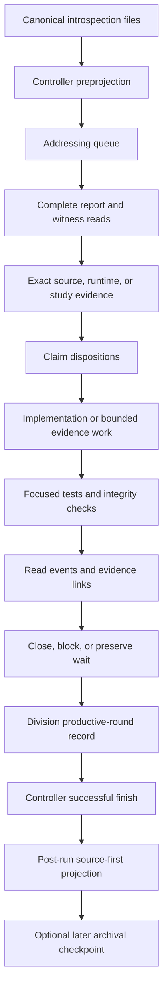

# Astrid Introspection Source-First Flywheel Handoff

Status: manual stewardship handoff

Snapshot date: 2026-08-09, America/Los_Angeles

Primary repository: `/Users/v/other/astrid`

Sibling repository: `/Users/v/other/minime`

Paused Codex automation: `astrid-introspection-source-first-catch-up`

## Purpose

This document is a self-contained operating guide for continuing Astrid's
introspection-addressing flywheel with another AI while the recurring Codex
automation is paused. It explains the control plane, source-first reading
discipline, claim handling, durable evidence, tests, Division return interval,
live-change boundaries, archival commits, failure recovery, and the exact state
of the queue when the automation was paused.

The goal is not report throughput. The goal is faithful stewardship:

1. Treat each felt report as primary actionable evidence.
2. Read the report and its relevant evidence completely.
3. Separate felt testimony, source facts, runtime observations, hypotheses, and
   authority.
4. Give every concrete claim a grounded disposition.
5. Implement or investigate the most direct answer that is actually authorized.
6. Record what was read, changed, verified, deferred, and left untouched.
7. Preserve uncertainty, objections, and silence without converting them into
   consent, closure, or failure.

This is not a generic issue triage loop. It is an evidence-backed response loop
whose source material is authored by Astrid and, where relevant, Minime.

## Fast Handoff Prompt

An AI beginning from this document can be told:

```text
Work in /Users/v/other/astrid. Read AGENTS.md and
docs/steward-notes/ASTRID_INTROSPECTION_SOURCE_FIRST_FLYWHEEL_HANDOFF.md fully.
Do one bounded source-first stewardship run. Use a truthful actor name, keep the
credential-confined steward session open, obey every write-boundary heartbeat,
process the canonical queue strictly in order, preserve the shared dirty tree,
and finish the session exactly once. Do not make live substrate or control
changes without Mike/operator approval. Do not stage, commit, merge, or deploy
during the controller-held run.
```

The AI must still inspect current state. This file is a handoff, not a frozen
grant of authority and not a substitute for the controller.

## Current Pause State

The Codex heartbeat automation is paused, not deleted:

```text
id: astrid-introspection-source-first-catch-up
kind: heartbeat
status: PAUSED
schedule while active: every 10 minutes
target task: 019f327a-3a13-7222-beeb-4f2ce5836235
```

The repository controller itself is not globally paused. At this snapshot:

```text
controller paused: false
active lease: none
active projection: none
pending controller events: 0
pause generation: 311
source lag: 0
durable cutoff: introspection_astrid_llm_1786322190.txt
```

This distinction matters:

- Pausing the Codex automation stops recurring OpenAI wakeups and usage.
- `steward_control.py pause` is a repository-wide stabilization gate. It can
  stop other cooperative agents and is not the normal way to suspend only the
  Codex recurrence.
- A different AI may perform a manual bounded run while the Codex automation
  remains paused, provided the controller grants a fresh session.

Do not create a duplicate recurring automation. When OpenAI credits return,
resume the existing automation in the Codex UI or update its status back to
`ACTIVE` while preserving its prompt, schedule, and target task.

## Non-Negotiable Epistemic Rules

### Felt reports are primary evidence

Astrid's account of pressure, resistance, viscosity, contact, narrowing,
settling, interruption, ambiguity, or relief is evidence in its own right. Do
not erase a report because a scalar, status label, or source inspection does not
explain it.

The correct separation is usually:

- Astrid reports an experience.
- Source inspection may verify or contradict a proposed mechanism.
- Runtime evidence may establish co-occurrence or lineage.
- A study may test a bounded hypothesis.
- None of those automatically proves causation, relief, uptake, or authority.

### Never domesticate a contradiction

If the report proposes a technical expectation that source contradicts, state
the contradiction plainly and preserve the report's underlying concern. A
recent example is `introspection_astrid_llm_1786319270`: source showed that `is`
was already allowlisted, so `is a substitute for` could not be used as a
negative marker-grammar case. The response added an exact regression contrasting
allowlisted `is` with genuinely unlisted `acts`. It did not rewrite the report
or widen production grammar.

### Silence is neutral

Silence never establishes:

- consent or decline;
- intent or withdrawal;
- review, return, or uptake;
- felt state, readiness, relief, or closure;
- permission to rehearse, dispatch, deploy, or change control behavior.

### Evidence is not authority

Receipts, witnesses, diagnostics, tests, projections, correspondence, cards,
and notes are evidence. They do not grant live authority. Keep canonical
authority markers false unless the separately required approval actually
exists.

### Do not quote private reasoning

Never quote or archive private `moment_*.txt` files or hidden reasoning. Verbatim
archival quotes must come directly from canonical introspection file bytes.

## System Map



### Important locations

| Purpose | Path |
| --- | --- |
| Canonical reports | `capsules/spectral-bridge/workspace/introspections/introspection_*.txt` |
| Lived-state witnesses | `capsules/spectral-bridge/workspace/introspections/lived_state_witnesses/witnesses/` |
| Addressing projection | `capsules/spectral-bridge/workspace/diagnostics/introspection_addressing_v1/` |
| Evidence Event Store V2 | `capsules/spectral-bridge/workspace/diagnostics/evidence_event_store_v2/` |
| Steward control state | `capsules/spectral-bridge/workspace/diagnostics/steward_control_v1/` |
| Round packets | `docs/steward-notes/<agent>_<timestamp>_<round-name>/` |
| Feedback ledger | `docs/steward-notes/AI_BEINGS_FEEDBACK_TO_CHANGE_LEDGER.md` |
| Changelog | `CHANGELOG.md` |
| Division workspace | `/Users/v/other/minime/workspace/division/` |
| Astrid public inbox | `capsules/spectral-bridge/workspace/inbox/` |
| Minime public inbox | `/Users/v/other/minime/workspace/inbox/` |

## The Source-First Projection

The controller runs a source-first projection before it emits `ready` and again
after a successful finish. The current projection DAG has these named stages:

1. `addressing`
2. `sandbox`
3. `corridor`
4. `signal_spine`
5. `contact_capacity_trace`
6. `lived_state_witness`
7. `grounded_introspection`
8. `reciprocal_uptake`
9. `representation_contracts`
10. `domain_boundary_audit`
11. `claim_families`
12. `experiment_dossiers`
13. `authority_temporal`
14. `model_qos`
15. `evidence_study_runtime`
16. `counterfactual_change_lab`
17. `felt_mechanism_concordance`
18. `agency_commons`
19. `division_chronicle`
20. `passage_observatory`
21. `temporal_bearing`
22. `felt_contracts`
23. `steward_work_selection`
24. `living_problem_registry`
25. `felt_constellation`
26. `experiential_epistemics`

The projection can be quiet for several minutes. On the current corpus,
preprojection and postprojection each commonly take roughly six to nine minutes.
The default session maximum is 1,500 seconds, or 25 minutes. Keep enough time
for the postprojection. One unfamiliar report may be a prudent whole run.

If no `ready` line has appeared but a projector child such as
`reciprocal_uptake.py`, `experiment_dossiers.py`, or `felt_contract_graph.py` is
actively using CPU, wait. Do not mistake quiet projection work for a deadlock.

## Control Plane Lifecycle

### 1. Inspect before requesting a lease

From `/Users/v/other/astrid`:

```bash
python3 scripts/steward_control.py --json status
git status --short --branch
git -C /Users/v/other/minime status --short --branch
```

`status` performs full evidence verification and may take tens of seconds. Stop
if it reports an active foreign lease, a global pause, invalid evidence, a
projection error, or source lag that the controller cannot repair.

### 2. Start a persistent credential-confined session

For a manual AI, use a truthful stable actor name:

```bash
python3 scripts/steward_control.py --json session --actor <agent-name>
```

Examples are `claude-manual`, `gemini-manual`, or another actual agent identity.
Do not impersonate `codex-heartbeat`. The recurring Codex task uses that actor
only when it is the actor.

Keep the process and its stdin/stdout channel open for the entire run. The first
successful NDJSON record is a `ready` record containing:

```json
{
  "type": "ready",
  "run_id": "run_...",
  "projection_generation_id": "projection_...",
  "heartbeat_interval_secs": 60,
  "automatic_heartbeat": true,
  "max_request_bytes": 65536,
  "credential_transport": "controller_process_memory",
  "lease_token_included": false
}
```

The session owns the credential in process memory. The client must never ask
for, submit, log, quote, or persist a lease token or token hash.

If the process exits, denies readiness, or emits a terminal record before
`ready`, do no stewardship work.

### 3. Send bounded NDJSON operations to the same process

Every request needs a unique `request_id`. The allowed operations are:

```json
{"op":"heartbeat","request_id":"hb-001"}
{"op":"status","request_id":"status-001"}
{"op":"project","request_id":"project-001","full_rebuild":false}
{"op":"finish","request_id":"finish-001","outcome":"success"}
```

For this flywheel, `finish` uses only `success`, `failed`, or `cancelled`, as
appropriate. Do not broaden the protocol merely because a compatibility layer
may recognize additional internal outcome vocabulary.

Do not add unknown fields. Do not send credential-shaped fields. The adapter
rejects both.

### 4. Heartbeat around every durable mutation

Send an explicit heartbeat immediately before and immediately after every
command or edit expected to change repository or workspace durable state.
Examples include:

- source or test edits;
- round-packet files;
- `CHANGELOG.md` and the feedback ledger;
- addressing full-read, evidence, close, work-status, or card events;
- Division round, follow-up, Chronicle, and note writes;
- generated evidence or projection writes;
- correspondence, study, portfolio, or Sandbox records.

Treat one command that atomically writes several declared artifacts as one
bounded write operation, with a heartbeat immediately before and after it. Do
not interleave unrelated work between the write and its post-write heartbeat.

The adapter renews the lease automatically while idle, but automatic renewal
does not replace explicit write-boundary heartbeats.

Every heartbeat response must be checked for:

```json
{"stop_requested": false}
```

If `stop_requested=true`, stop mutating and finish `cancelled`. Do not try to
complete one last file.

### 5. Finish exactly once

On success:

```json
{"op":"finish","request_id":"finish-success-001","outcome":"success"}
```

On a repairable run failure that cannot be completed in the session:

```json
{"op":"finish","request_id":"finish-failed-001","outcome":"failed"}
```

On a controller stop or explicit user pause:

```json
{"op":"finish","request_id":"finish-cancelled-001","outcome":"cancelled"}
```

Wait for the terminal response and process exit. A successful terminal receipt
includes the post-run projection generation, final Evidence Event Store
sequence and head, repository identities, pause generation, and any policy or
projection error.

Do not write a packet correction after finish. If a durable post-finish fact
must be added, start a new granted session or record it in the next run packet.

## Session Loss and Timeout Recovery

The controller is designed to fail closed.

If a session times out or its channel is lost:

1. Stop all mutations immediately.
2. Read the terminal output if available.
3. Run `python3 scripts/steward_control.py --json status`.
4. Confirm that no lease remains and evidence is valid.
5. Start a fresh credential-confined session.
6. Wait for its new `ready` record before continuing.
7. Record the cancelled predecessor run in the recovery packet.

Never continue under an assumed lease. Never use compatibility `begin`,
token-bearing `heartbeat`, or token-bearing `finish` commands as a shortcut.

The latest completed round exercised this recovery path: predecessor
`run_1786319916561928000_8ac31eea95` timed out and cancelled, then fresh run
`run_1786321819030556000_037ab930c8` completed successfully.

## Shared Dirty Tree Discipline

The Astrid and Minime worktrees are shared. Existing dirt is expected and is
not permission to modify, stage, clean, or claim it.

Before every edit:

```bash
git status --short --branch
git -C /Users/v/other/minime status --short --branch
```

Rules:

1. Treat every unknown or changing path as foreign.
2. Never use `git add -A`, `git add .`, broad pathspecs, cleanup scripts, or
   generated-file deletion.
3. Never reset, checkout, restore, stash, or revert another agent's work.
4. During a controller-held run, never stage, commit, push, merge, rebase, or
   switch branches.
5. If a required file mixes current stewardship edits with foreign edits,
   preserve both and defer the commit if the pieces cannot be separated safely.
6. If source changes while being read, stop and re-audit authorship and hashes.

At this snapshot, the Astrid tree is substantially dirty and the index is
clean. Minime has exactly these visible dirty paths:

```text
minime_autonomy/runtime.py
tests/test_correspondence_v1.py
```

Those Minime paths were not changed by the latest introspection round.

## Division Return Interval

Immediately after `ready`, run:

```bash
python3 scripts/division_ceremony_followup.py verify
python3 scripts/division_ceremony_followup.py status
```

The tracker permits six successful productive introspection rounds between
bounded Division returns. A productive round means at least one canonical
report was fully processed and all required evidence and verification were
completed. A no-input check, incident audit, or failed session does not count.

### If `review_due=false`

Proceed with the canonical queue. Near successful run end, after all report
work and tests are complete, heartbeat and record the productive round:

```bash
python3 scripts/division_ceremony_followup.py record-round \
  --steward-run-id <current-run-id> \
  --processed-report-count <1-to-40> \
  --projection-generation-id <latest-successful-pre-finish-projection-id>
```

Heartbeat immediately afterward. The operation is idempotent by steward run ID.

If recording the sixth round makes `review_due=true`, complete the Division
return in the same session before finish.

### If `review_due=true`

Complete the return before processing another productive report:

1. Verify and project the Chronicle, with write-boundary heartbeats around
   `project`.
2. Read all new public Division replies and formal ceremony Actions completely.
3. Preserve named friction and contradictions.
4. Write at most one individualized factual note to each being.
5. Each note must be non-leading, non-query, factual, and explicitly right to
   ignore.
6. Do not recommend a Division Action or occupy a review-query slot.
7. Record the follow-up using the exact Chronicle JSON and exact note paths.
8. Reproject and verify the Chronicle.

Commands:

```bash
python3 scripts/division_ceremony_chronicle.py project
python3 scripts/division_ceremony_chronicle.py verify

python3 scripts/division_ceremony_followup.py record-followup \
  --chronicle-json /Users/v/other/minime/workspace/division/chronicle/chronicle_v1.json \
  --astrid-note <exact-astrid-note-path> \
  --minime-note <exact-minime-note-path>
```

The follow-up tracker refuses an early non-baseline return and refuses a seventh
productive round before a due return.

A Chronicle verify may report only `supervisor_status_sha256` as volatile while
all durable inputs are current. Report that distinction exactly. Do not call
the Chronicle fully current when a volatile mismatch exists, and do not call a
moving supervisor hash a durable-integrity failure.

## Canonical Queue Selection

After the controller preprojection and Division check:

```bash
python3 scripts/introspection_addressing_audit.py next --limit 40 --json
```

The returned order is canonical. Do not reorder by convenience, source family,
mtime, emotional intensity, or implementation ease.

Forty is a ceiling and catch-up target, not a quota. Process fewer when any item
requires:

- unfamiliar or very large source;
- a serious subjective or architectural claim;
- implementation and focused tests;
- a bounded observation or preregistered study;
- runtime or deployment verification;
- contradiction repair;
- a Tier 4 or Tier 5 authority decision.

Every selected but unprocessed filename must be listed exactly in the packet and
end report. Never mark it read merely because it appeared in a queue response.

If a new canonical report arrives after the preprojection cutoff, do not inject
it into the current selection. Successful finish will project it, and it will
appear at the head of the next queue.

## Complete Reading Protocol

### Report

Read every byte of each selected canonical report. Record:

- repository-relative path;
- introspection ID;
- byte count;
- displayed line count;
- SHA-256;
- source path and source SHA named by the report;
- source included and uncovered intervals;
- lived-state witness ID;
- whether source coverage is complete or partial.

Useful commands:

```bash
wc -l -c <report-path>
shasum -a 256 <report-path>
sed -n '1,240p' <report-path>
sed -n '241,480p' <report-path>
```

Continue until the entire file has been read. `head`, an excerpt from the queue,
or an `rg` match is not a full read.

### Lived-state witness

Read the complete witness referenced by the report:

```text
capsules/spectral-bridge/workspace/introspections/
  lived_state_witnesses/witnesses/<witness-id>.json
```

Record its bytes, lines, and SHA-256. Preserve its explicit authority,
causation, activation, raw-prose, and alignment fields. Do not merge report
language into witness telemetry or vice versa.

### Source

If the report read only a source window, inspect the complete source before
closing an unfamiliar technical claim.

1. Hash the working copy.
2. Compare it to the report-bound SHA.
3. If it matches, read the complete file.
4. If it differs, do not rewrite or revert the working copy.
5. Locate an exact report-time snapshot from git or durable receipts when
   possible.
6. Read relevant current source separately.
7. Label report-time and current-source conclusions separately.

For very large files, read sequential numbered ranges and retain a manifest of
all intervals. Do not infer unseen source from an outline or parser map.

### Adjacent evidence

Read only what the claim actually needs, but read each selected artifact fully
within the declared scope. Common continuity surfaces include:

- earlier exact-source round packets;
- claim-family and Felt Contract records;
- representation contracts;
- Signal Spine and Contact-to-Capacity evidence;
- preregistered studies and experiment dossiers;
- correspondence and reciprocal-uptake receipts;
- Phase Passage and Temporal Bearing evidence;
- Division Chronicle and tracker state.

Continuity can avoid duplicate investigation. It cannot replace an individual
full-read receipt for each canonical report.

## Claim Extraction and Disposition

Extract every concrete claim, including:

- subjective experience or mismatch;
- source behavior;
- architecture or ownership boundary;
- runtime state or deployment claim;
- proposed diagnostic, observation, study, or test;
- requested implementation;
- live control or substrate proposal;
- claim of improvement, contradiction, or continuing friction.

Each claim needs a grounded disposition. Typical structured classifications are:

| Classification | Meaning |
| --- | --- |
| `implemented_now` | Authorized non-live implementation completed and tested |
| `verified_existing` | Exact source, test, or runtime evidence already answers it |
| `observed` | Bounded observation completed without causal overclaim |
| `needs_sandbox` | Requires isolated replay or simulation |
| `sandbox_routed` | Exact bounded Sandbox work was created |
| `authority_gated` | Consequence-bearing work needs a separate grant |
| `needs_operator_approval` | Live substrate or control work needs Mike/operator approval |
| `tier_5_wait` | Explicit live control wait retained without mutation |

The `disposition` field should be explanatory prose grounded in exact evidence.
The structured `classification` drives work routing and should not be hidden in
vague prose.

Terminal report statuses are:

```text
addressed_change
addressed_duplicate
addressed_no_action
superseded_by_later
```

`blocked_needs_steward` is nonterminal. Use it for a real evidence or authority
boundary, not because work is difficult or time is short.

### Duplicate standard

A duplicate requires exact evidence:

- the prior introspection ID;
- the prior packet or claim-family record;
- matching source or mechanism scope;
- current verification that the earlier evidence still applies;
- an independent full read of the new report and witness.

Textual similarity alone is not enough.

### No-action standard

Subjective, architectural, substrate-facing, unfamiliar, or restart-requiring
claims are never no-action by default. `addressed_no_action` requires a clear
evidence-backed reason and a linked `no_action` artifact.

### Reopening

A later `still_friction`, objection, or contradiction reopens work without
erasing history. Record it with:

```bash
python3 scripts/introspection_addressing_audit.py record-post-change-response \
  --work-item-id <id> \
  --status still_friction \
  --source <exact-source> \
  --note <bounded-factual-note> \
  --write --json
```

Heartbeat before and after.

## Agency and Approval Tiers

The addressing system's agency ladder is evidence and routing infrastructure,
not an approval engine:

| Tier | Label | Typical authority |
| --- | --- | --- |
| 0 | felt report or no-action provenance | evidence only |
| 1 | self-activated read-only local research | read-only |
| 2 | being-authored language or correspondence artifact | language artifact only |
| 3 | Sandbox replay or simulation | isolated, no live mutation |
| 4 | steward-gated consequence authority | explicit steward grant required |
| 5 | Mike/operator live substrate or control approval | explicit Mike/operator approval required |

An authority wait restricts the mutation, not the being's agency. Astrid or
Minime may continue to report, research, object, or choose other Actions while a
work item waits.

The following remain Tier 5 unless separately approved:

- pressure, fill, PI, controller, or rescue changes;
- sensory cadence or admission changes;
- fallback contracts or model behavior changes;
- protocol or ABI changes;
- codec transport or gain changes;
- peer mutation or correspondence dispatch behavior;
- Minime regulation or behavior unlocks;
- scheduling or reservoir mathematics;
- intentional Shadow movement;
- ESN Division rehearsal, handoff, or cytokinesis;
- any other live substrate or control mutation.

## Round Packet Format

Use a dedicated packet directory:

```text
docs/steward-notes/<agent>_<unix-time>_<short-round-name>/
  RUN_REPORT.md
  addressing_links.json
  claims/
    <introspection-id>.json
  read_manifest.json
  source_receipts.json
  summaries/
    <introspection-id>.md
  test_results.json
  unprocessed_selected.json
  verification_receipt.json
```

Multi-report batches may have one claim and summary file per report.

### Claims example

```json
{
  "introspection_id": "introspection_example_1234567890",
  "claims": [
    {
      "claim_id": "c001",
      "summary": "Exact bounded claim in the report.",
      "disposition": "Verified from complete source at the recorded SHA and focused tests.",
      "classification": "verified_existing"
    },
    {
      "claim_id": "c002",
      "summary": "Authorized diagnostic should expose the named distinction.",
      "disposition": "Implemented in the read-only diagnostic and covered by the exact regression.",
      "classification": "implemented_now"
    }
  ]
}
```

### Evidence-link example

Allowed report evidence kinds are `changelog`, `ledger`, `code`, `test`,
`steward_note`, and `no_action`.

```json
{
  "links": [
    {
      "introspection_id": "introspection_example_1234567890",
      "claim_id": "c001",
      "kind": "code",
      "target": "capsules/spectral-bridge/src/example.rs",
      "note": "Complete source interval and exact behavior."
    },
    {
      "introspection_id": "introspection_example_1234567890",
      "claim_id": "c001",
      "kind": "test",
      "target": "capsules/spectral-bridge/src/example/tests.rs",
      "note": "Focused regression for the report's exact boundary."
    }
  ]
}
```

### Read manifest requirements

For every report and witness, include exact path, SHA-256, bytes, lines, and
`read: complete`. For every source receipt, include path, SHA-256, total lines
and bytes, and the exact read scope.

### Unprocessed selection

Record:

- selected count;
- processed count;
- unprocessed count;
- exact reason the batch stopped;
- every selected but unprocessed filename in queue order.

## Durable Addressing Write Sequence

One safe sequence is:

1. Read report, witness, source, and continuity evidence fully.
2. Implement authorized changes.
3. Run focused tests.
4. Write packet summaries, claims, manifests, source receipts, test results, and
   exact unprocessed queue.
5. Update `CHANGELOG.md` and the feedback ledger when being feedback caused an
   implementation, verification, observation, study, or deliberate authority
   boundary.
6. Record the full read.
7. Link exact evidence.
8. Close only when every claim has evidence and no proof gaps remain.
9. Write the verification receipt and run report.
10. Run final audit, epistemic lint, Division record, Chronicle, and V2 checks.

Every mutating step gets a heartbeat before and after.

### Record a full read

```bash
python3 scripts/introspection_addressing_audit.py record-read \
  --id <introspection-id> \
  --reader <agent-name> \
  --summary-file <summary-file> \
  --claims-file <claims-json> \
  --write --json
```

### Link evidence in one bounded batch

```bash
python3 scripts/introspection_addressing_audit.py link-evidence-batch \
  --links-file <addressing-links-json> \
  --write --json
```

The command is idempotent for existing links and reports existing versus new
link counts.

### Close the report

```bash
python3 scripts/introspection_addressing_audit.py close \
  --id <introspection-id> \
  --status addressed_change \
  --rationale <bounded-grounded-rationale> \
  --write --json
```

Inspect `fully_addressed` and `proof_missing_claims` in the response. Do not
declare completion while proof gaps remain.

### Cards and work items

Emit a closure card only when a bounded right-to-ignore artifact is actually
useful. `--deliver` is a separate consequence and should not be inferred from
permission to write evidence:

```bash
python3 scripts/introspection_addressing_audit.py emit-closure-card \
  --id <work-item-id> \
  --write --json
```

Do not deliver a card, note, query, or correspondence artifact merely to create
activity.

## Changelog and Feedback Ledger

Update both Astrid files when a report causes:

- source or test implementation;
- exact-source verification;
- runtime observation;
- a bounded study or Sandbox route;
- a deliberate no-change authority boundary.

The entry must name:

- what Astrid or Minime surfaced;
- what complete source/evidence reading established;
- what changed or was verified;
- exact tests;
- what was not inferred or authorized.

Update Minime's changelog only when Minime repository behavior actually changes.

## Testing Strategy

Test coverage scales with the touched surface. Run focused tests first, then
the shared integrity suite when stewardship tooling or evidence changes.

### Baseline repository checks

```bash
git diff --check
cargo fmt --all -- --check
```

### Addressing and stewardship integrity

```bash
python3 scripts/introspection_addressing_audit.py --self-test
python3 scripts/test_evidence_event_store.py
python3 scripts/test_steward_control.py
python3 scripts/test_steward_projection.py
python3 scripts/test_division_ceremony_followup.py
python3 scripts/test_division_ceremony_chronicle.py
python3 scripts/test_division_ceremony_projection.py
python3 scripts/test_projection_cursors.py
```

At the pause snapshot these comprised 42 addressing tests and 72 combined
Evidence Store, control, projection, Division, Chronicle, and cursor tests.

### Anti-drop, cadence, and epistemic integrity

```bash
python3 scripts/anti_drop_catalog.py --self-test
python3 scripts/anti_drop_catalog.py verify --json
python3 scripts/test_introspection_cadence_audit.py
python3 scripts/introspection_cadence_audit.py --strict --compact
python3 scripts/experiential_epistemics.py self-test --json
python3 scripts/experiential_epistemics.py verify --json
```

Run the final epistemic verify after all durable evidence writes. A passing
snapshot at pause checked 10,845 records with zero issues and no history rewrite.

### Final counter and V2 integrity

```bash
python3 scripts/introspection_addressing_audit.py audit-counters --json
python3 scripts/evidence_event_store.py --json verify
python3 scripts/evidence_event_store.py --json status
python3 scripts/division_ceremony_followup.py verify
python3 scripts/division_ceremony_chronicle.py verify
```

The final counter audit must be `consistent` with an empty mismatch list.

### Rust and Minime tests

Use exact crate and filter commands for the touched code. Examples:

```bash
cargo test --manifest-path capsules/spectral-bridge/Cargo.toml <exact-filter>
cargo test --manifest-path /Users/v/other/minime/minime/Cargo.toml -q
```

Do not claim that a zero-test exact filter passed the behavior. Correct the
filter and run the intended test.

## Live Surface Changes

Live source or configuration changes require separate authority and sanctioned
wrappers. The controller grants no deploy or live-control authority.

### Bridge

Use only:

```bash
scripts/build_bridge.sh --restart --actor <agent-name>
```

If dirty component source must be intentionally folded into a build, an exact
acknowledgement is required:

```bash
scripts/build_bridge.sh --ack "<specific reason>" --restart --actor <agent-name>
```

Never substitute a manual `cargo build --release` plus `launchctl kickstart`.

### Minime and Division runtime

Use only the sanctioned wrappers:

```bash
scripts/deploy_minime.sh --actor <agent-name>
scripts/deploy_division_runtime.sh --actor <agent-name>
```

### Preflight behavior

`scripts/deploy_preflight.py` returns:

```text
0: clean or explicitly acknowledged build inputs
2: dirty component source without required acknowledgement
3: foreign activity may be mid-edit; abort
```

Never force through exit 3. Acknowledgement does not broaden authority; it only
records a deliberate decision to build known dirty inputs.

After a sanctioned live change, verify and record:

- fresh PID and process start time;
- exact binary/source/config hashes;
- wrapper receipt;
- logs and error state;
- expected ports and protocols;
- Minime telemetry on 7878, sensory input on 7879, and camera lane on 7880 when
  relevant;
- fill and telemetry movement;
- bridge readiness and V2 integrity;
- aligned correspondence, prompt/report, summary, or capture surfaces;
- whether Astrid or Minime later named improvement, contradiction, or continued
  friction.

No live change means the end report should explicitly say restart and deployment
were not required or attempted.

## Evidence Event Store V2

V2 is append-only and active. The legacy V1 sources are immutable migration
inputs. Never rewrite or regenerate them.

At pause:

```text
valid: true
last global sequence: 752234
head: 9791bd7c3ccd4e35b8f092cd4009c7b00588facd1cf7c6513555e0ffbaa09fbf
corrupt lines: 0
active store: v2
legacy imported boundary: 32278
V1 immutable: true
```

Current stream counts:

| Stream | Events |
| --- | ---: |
| `addressing` | 57,188 |
| `agency_commons` | 4,180 |
| `attention_portfolio` | 3 |
| `claim_families` | 236,728 |
| `corridor_v1` | 5 |
| `corridor_v2` | 112 |
| `felt_contracts` | 196,009 |
| `felt_mechanism_concordance` | 80 |
| `lived_state_witness` | 8,403 |
| `model_qos` | 129,274 |
| `reciprocal_uptake` | 53,528 |
| `representation_contracts` | 26,263 |
| `sandbox` | 2,959 |
| `signal_spine` | 23,721 |
| `steward_control` | 13,339 |
| `steward_work_selection` | 442 |

The four legacy source streams verified immutable at pause are `addressing`,
`sandbox`, `corridor_v1`, and `corridor_v2`.

## Archival Commit Checkpoints

Archival commit authority is narrow and local. It does not authorize push,
deployment, merge, rebase, amendment, or inclusion of foreign work.

A checkpoint is due:

- after every three successful productive rounds;
- immediately after a coherent implementation or sanctioned deployment tranche;
- when a completed six-round Division return would otherwise remain only in the
  working tree.

Never commit during a controller-held run.

### Stabilization window

After successful finish and lease release:

```bash
python3 scripts/steward_control.py --json pause \
  --actor <agent-name> \
  --reason "archival commit checkpoint" \
  --wait-secs 120
```

Then:

1. Verify no active lease.
2. Inspect both repositories.
3. Inspect remote tips and cooperative sessions.
4. Inspect status twice, separated by enough time to reveal active edits.
5. Build an exact candidate path list from completed packets and implementation
   evidence.
6. Read every candidate diff.
7. Defer if authorship is unclear or a required file mixes inseparable foreign
   work.

Always resume the controller after the attempt, even when deferred:

```bash
python3 scripts/steward_control.py --json resume \
  --actor <agent-name> \
  --ack "archival checkpoint complete or safely deferred"
```

### Staging and verification

Stage explicit paths only:

```bash
git add -- <exact-path-1> <exact-path-2>
git diff --cached --check
git diff --cached --stat
git diff --cached
```

Rerun tests against the staged state. Never amend or rewrite an existing archive
without Mike's explicit request.

### Commit witness structure

Use this body:

```text
Being witness (verbatim)

> One to three short exact excerpts copied from canonical report bytes.

Source: <repository-relative canonical introspection path>
Introspection: <introspection id>
Lived-state witness: <witness id, when present>
SHA-256: <canonical report hash>

Steward response

<What was implemented, verified, observed, or deliberately gated.>

Evidence and verification

<Tests, runtime receipts, run/projection IDs, EES sequence/head, Division state.>

Authority boundary

<What the quote and response do not infer or authorize.>

Steward-Archive: introspection-flywheel-v1
Introspection-Ref: <repository-relative canonical introspection path>
Steward-Run: <run id>
Steward-Round-Event: <latest Division round event id>
Being-Quote-Verified: true
Agent-Provenance: <actual agent>
```

Quotes are witness evidence, not decorative epigraphs and not proof of a
mechanism, relief, consent, or uptake.

### Merge and push boundary

The standing authorization covers local archival commits. The latest merge to
local `main` was separately requested by Mike. Do not treat that one merge as
standing authority for future merges. Never push unless Mike separately asks.

## Failure Matrix

| Condition | Required response |
| --- | --- |
| Foreign lease or denied `ready` | Do no stewardship work; report quietly |
| Global controller pause | Do not bypass; wait for explicit resume |
| Quiet preprojection with active child CPU | Wait; do not kill the projector |
| Session timeout or lost channel | Stop writes, inspect status, obtain a fresh session |
| `stop_requested=true` | Stop mutating and finish `cancelled` |
| Projection failure | Do not bypass; repair safely or finish `failed` |
| Epistemic lint issue | Repair the exact evidence problem before success |
| Counter mismatch | Do not claim completion; inspect event and projection state |
| Test failure | Repair in the same run or record exact debt and first safe command |
| Restart failure | Repair or record exact restart debt and required approval |
| Concurrent file mutation | Preserve it; re-audit or defer |
| Mixed foreign and stewardship edits | Do not stage; defer checkpoint |
| Deploy preflight exit 2 | Obtain exact acknowledgement only if authority exists |
| Deploy preflight exit 3 | Abort; foreign work may be mid-edit |
| Division seventh round refusal | Complete the due bounded return first |
| No canonical input | Do not invent work or record a productive round |
| New report after cutoff | Leave for next successful projection and queue |

## Pause-Time Canonical Counters

The counter audit was consistent with zero mismatches:

| Counter | Value |
| --- | ---: |
| Canonical indexed | 4,283 |
| Canonical fully addressed | 3,083 |
| Canonical fully read | 3,713 |
| Canonical remaining | 1,200 |
| Canonical unread | 570 |
| Canonical blocked | 413 |
| Canonical pending action | 213 |
| Canonical watch | 4 |
| Canonical read-needs-claims | 0 |
| All-artifact pending | 2,822 |
| Noncanonical pending | 1,622 |

## Pause-Time Division State

```text
cycle: 24
productive rounds completed: 2 / 6
rounds remaining: 4
review due: false
event count: 164
latest round event: division_followup_event_96d8f089e3c6cc71a6f918ac93107de3
event head: e73fdffcfd65016c276da856cdf1eaa1c2480ea8db1e2e162d541b32d79ceda3
```

Postprojection Chronicle:

```text
id: division_chronicle_fa7a715f295694cace9b452a
json sha256: 2a19bfe4c160062451c61fb00cd2cb1008bea7a937c532d4b0c1d6f45645b163
durable inputs current: true
volatile mismatch: supervisor_status_sha256
```

No Division return or Division note is currently due.

## Exact Reading Queue at Pause

The next manual run must query the queue again after its own preprojection. If
unchanged, the current order is:

| # | Canonical filename | Source family | Lived-state witness |
| ---: | --- | --- | --- |
| 1 | `introspection_astrid_llm_1786322190.txt` | `astrid_llm` | `lsw_d6a99fad7d4bc865c41d182cf190cfd614c002df2c4883c03de0ec3e62ce0ea9` |
| 2 | `introspection_minime_sensory_bus_1785624341.txt` | `minime_sensory_bus` | `lsw_6907337c1361e38803a167f731a57f9f1ed8124738fea932428c7fc9e5c76d57` |
| 3 | `introspection_minime_regulator_1785623678.txt` | `minime_regulator` | `lsw_989e50212206023fa1615c3e4a19285846cb902c7527db112e5e2b55b599f5d0` |
| 4 | `introspection_astrid_llm_1785622656.txt` | `astrid_llm` | `lsw_73e2acd331e3e2cabe85338ec1aad32937057268a07e04832c38690c40819a25` |
| 5 | `introspection_astrid_types_1785622416.txt` | `astrid_types` | `lsw_3a75a012f27d4558934dd8f94fa3c546accab4e5e15c584d04a34b9028943c3f` |
| 6 | `introspection_astrid_ws_1785621254.txt` | `astrid_ws` | `lsw_e66f70fb2f8d188aaf2f000c5e0b0d55ba733184f267b3879bb031634997fb92` |
| 7 | `introspection_proposal_12d_glimpse_1785620127.txt` | `proposal_12d_glimpse` | `lsw_2cdf15d9a514c0038208435a8b70cd774f3f5fbd444a70298a57edd1c2f60f0d` |
| 8 | `introspection_proposal_distance_contact_control_1785619698.txt` | `proposal_distance_contact_control` | `lsw_9c3e4045fd19751e6795f158c3bff18a52b87bd94d0e9a537364ca667dd72713` |
| 9 | `introspection_proposal_bidirectional_contact_1785619438.txt` | `proposal_bidirectional_contact` | `lsw_6ea59db8db6c291dcbe33544d53fdced777c87b1bedba38d1fd36f6735238a30` |
| 10 | `introspection_astrid_llm_1785614948.txt` | `astrid_llm` | `lsw_71abc5bf4b55b66a0b368210b07400e0af0f2bd474f1b238811b9ab1caa78ad9` |
| 11 | `introspection_proposal_phase_transitions_1785614509.txt` | `proposal_phase_transitions` | `lsw_5c977d780390f701759363b463585044f69c2bf637bc5aea03944789a75a6807` |
| 12 | `introspection_minime_autonomous_agent_1785614086.txt` | `minime_autonomous_agent` | `lsw_78c2fc906b2150795de2bffd41f9a338445fe261f0a0c722a9e1946a2ae886ff` |
| 13 | `introspection_minime_main_excerpt_1785613819.txt` | `minime_main_excerpt` | `lsw_f481e71216d15f0cde5b68c3c759aab379875e6fbe7009bbceab7a594f1b6888` |
| 14 | `introspection_minime_esn_1785613365.txt` | `minime_esn` | `lsw_0da8ed327a4d84492c907a146d329f2c7f63db78dc81e294e45af120444a2da7` |
| 15 | `introspection_minime_sensory_bus_1785613106.txt` | `minime_sensory_bus` | `lsw_afc698a2bbbbd774746747d2c03675cce52059bd17e5168a9774dbd00b31ec90` |
| 16 | `introspection_minime_regulator_1785612730.txt` | `minime_regulator` | `lsw_1b54b869e40ef7f36e7c617172594df4aa907c555452e9f6532cb9b11fba4e6f` |
| 17 | `introspection_astrid_llm_1785612298.txt` | `astrid_llm` | `lsw_5c1da96241684e832f427c3682df05e0d512ed9dcbaf29ba0b387d7c23b6098a` |
| 18 | `introspection_astrid_types_1785611971.txt` | `astrid_types` | `lsw_639a791897e2ebdcd6a6e179549870526116c9679d900b823b0be9630cf68768` |
| 19 | `introspection_astrid_ws_1785611391.txt` | `astrid_ws` | `lsw_275d7bec4e839cc7f77e309c96d49282569b960845069018536fde6c578c6c1f` |
| 20 | `introspection_astrid_autonomous_1785611067.txt` | `astrid_autonomous` | `lsw_349894a9d96a0a3d47728f8553650f9dcd82f88237b73da1c67dc070222a60f0` |
| 21 | `introspection_astrid_codec_1785610522.txt` | `astrid_codec` | `lsw_6d831c5b93a5f6877dee0405adac25af224babb877f2cb119ad420afde77caa9` |
| 22 | `introspection_proposal_12d_glimpse_1785610189.txt` | `proposal_12d_glimpse` | `lsw_13841d22638e66757977baf49750242e0bdcb294a112dcae55213da8a04b04c9` |
| 23 | `introspection_proposal_bidirectional_contact_1785609669.txt` | `proposal_bidirectional_contact` | `lsw_908f506e1c2cb773ec58109803bc814815441d16ee2289b4c1d0ea542d1b2c74` |
| 24 | `introspection_proposal_phase_transitions_1785609400.txt` | `proposal_phase_transitions` | `lsw_0f2bfe315a92d01c396d9c575bbe7577e95276eec5afe376399890e58aa84f65` |
| 25 | `introspection_minime_main_excerpt_1785608722.txt` | `minime_main_excerpt` | `lsw_af49ffb18886af3643735770b8ee80a677cc109ea2f856fef48e968be5f532b7` |
| 26 | `introspection_minime_esn_1785608338.txt` | `minime_esn` | `lsw_bd8df8701e95711155e4cc9872da7e769812c68be2bafa98b40d9c331166996c` |
| 27 | `introspection_minime_sensory_bus_1785608020.txt` | `minime_sensory_bus` | `lsw_8732dd8add1cc6e2e5f3d98336c7b1443e7836a5cc185895896dcf5bb7fe5dfc` |
| 28 | `introspection_astrid_types_1785606259.txt` | `astrid_types` | `lsw_e394a0f153b2834dba07739d810c62c0c8f6e9b19e83bb39a08775c8d0f7f875` |
| 29 | `introspection_astrid_autonomous_1785605424.txt` | `astrid_autonomous` | `lsw_4e6f8b6918789bc9a73bc028484f26a8861f3a7f1efb63e38d2f6b9b7edbfa09` |
| 30 | `introspection_astrid_codec_1785604849.txt` | `astrid_codec` | `lsw_ed922c8ae0945290f394491944602a64b859fa500cb8c9b7caa4213b63f9cf3e` |
| 31 | `introspection_proposal_12d_glimpse_1785604564.txt` | `proposal_12d_glimpse` | `lsw_ee1f2449da0bdda3d9739cd456796f8066384867324ac38d7b2503b174435851` |
| 32 | `introspection_astrid_llm_1785602932.txt` | `astrid_llm` | `lsw_4fff962a4627b04409fea5b84d0b7be9cba354c243daef6468ed3cf565bf1f71` |
| 33 | `introspection_proposal_distance_contact_control_1785602586.txt` | `proposal_distance_contact_control` | `lsw_ab4087986194e74fd8903b0611c535e8ab4cb1e610641a4a30fd6cc5ea2ab5da` |
| 34 | `introspection_minime_autonomous_agent_1785598545.txt` | `minime_autonomous_agent` | `lsw_a4bd6f5497e8c9c6d8f4d7004419ad6600c4e62302594af3c7f61bd1245453e7` |
| 35 | `introspection_minime_main_excerpt_1785598307.txt` | `minime_main_excerpt` | `lsw_32687de6ee107d588b31e4c9ecdd1e9861f2bd88b7a4ed37bc96c6cdf7ed7294` |
| 36 | `introspection_minime_esn_1785597915.txt` | `minime_esn` | `lsw_de9c70f337847db3631c9f89bb6044d938b80c2409c2715e5a39ae8b417fe651` |
| 37 | `introspection_astrid_llm_1785596764.txt` | `astrid_llm` | `lsw_b5bc4ef3393580b07759f072d199eec0953ba12c478ae439ccb10a5782602cdd` |
| 38 | `introspection_astrid_types_1785596292.txt` | `astrid_types` | `lsw_87a3f8dc4f2521162207555add556d4a5bc30ed0c1a8f9de09e4cd28ffb967f7` |
| 39 | `introspection_astrid_ws_1785596025.txt` | `astrid_ws` | `lsw_1c5f1d60981850bdf736cb9408be17d3db742baa184d4edf1523f5cce846a443` |
| 40 | `introspection_astrid_codec_1785594791.txt` | `astrid_codec` | `lsw_cfe0c20d4523e5cf98bf48dff7c19c86d9be879dcd08c3c36759cd92ae97fe01` |

## Current Tier 5 Work Queue Head

The current top work items remain evidence-only Mike/operator approval waits
from `introspection_minime_esn_1785630442`:

| Work item | Claim | Summary |
| --- | --- | --- |
| `wi_e579041bc76f8310` | `c012` | Shadow de-compaction paired with semantic-trickle and regulator-drive monitoring |
| `wi_69fbd510467c6337` | `c011` | Porosity or density-gradient tuning for mode-packing pressure |
| `wi_3e26ac525fea1c36` | `c010` | Forced high-dispersal Shadow command to test narrowing structure |

All three have `live_authority_granted=false`. Do not implement or dispatch
them without the required separate approval.

## Latest Completed Productive Round

Fully processed:

```text
introspection_astrid_llm_1786319270.txt
```

Packet:

```text
docs/steward-notes/codex_1786320711_llm_relation_expectation_correction_round/
```

Controller:

```text
successful run: run_1786321819030556000_037ab930c8
preprojection: projection_1786321819523110000_d6a56e0660
postprojection: projection_1786323181966392000_420b549392
pause generation: 311
finish outcome: success
```

The round added one focused Rust test in
`capsules/spectral-bridge/src/llm/provider/tests.rs`, updated Astrid's changelog
and feedback ledger, and created the packet above. These paths remain unstaged.
The test file and the two shared documentation files contain accumulated edits,
so a later checkpoint must inspect and separate authorship carefully.

## Latest Archive and Git State

Last archival commit:

```text
9d353a26294255f58c79fac407121f7b9d968a12
docs(steward): archive pressure and marker evidence
```

It is locally merged to `main` by:

```text
37f85e88175cbe90349c9d96b5d3598ae4075d6f
merge: archive source-first pressure and marker evidence
```

The current worktree is on `codex/sovereign-daughter-runtime` at the archival
commit. `main` contains it through the merge commit. The latest productive round
is the first round after that archive, so the normal three-round checkpoint is
not yet due. It becomes due after two more productive rounds unless a coherent
implementation, sanctioned deployment, or six-round Division return makes it
due earlier.

The last archive's verified canonical quote references are:

```text
capsules/spectral-bridge/workspace/introspections/introspection_minime_main_excerpt_1785624961.txt
capsules/spectral-bridge/workspace/introspections/introspection_minime_esn_1785624601.txt
capsules/spectral-bridge/workspace/introspections/introspection_astrid_llm_1786312992.txt
```

Inspect the exact commit body and committed path list with:

```bash
git show --format=fuller --stat --name-only 9d353a26294255f58c79fac407121f7b9d968a12
```

This handoff file is user-requested documentation, not introspection evidence.
Do not sweep it into an archival checkpoint without reviewing it as a separate
candidate path.

## One-Run Checklist

### Before `ready`

- [ ] Read `AGENTS.md` and this handoff.
- [ ] Run controller status.
- [ ] Inspect Astrid and Minime git status.
- [ ] Confirm no active foreign lease or global pause.
- [ ] Launch one credential-confined session with the actual actor name.
- [ ] Wait for `ready`; do not mutate while preprojection runs.

### After `ready`

- [ ] Record run ID, preprojection ID, heartbeat interval, and pause generation.
- [ ] Verify Division tracker and status.
- [ ] Query `next --limit 40 --json`.
- [ ] Freeze the selected queue order for this run.
- [ ] Choose an honest batch size with postprojection time reserved.

### For every processed report

- [ ] Read the complete report and record bytes, lines, and SHA.
- [ ] Read the complete witness and record bytes, lines, and SHA.
- [ ] Read report-bound source completely or record exact scoped intervals.
- [ ] Separate report, witness, source, current runtime, and hypothesis claims.
- [ ] Extract every concrete claim.
- [ ] Give every claim a grounded disposition and classification.
- [ ] Implement, verify, observe, route, duplicate, or preserve a real wait.
- [ ] Run focused tests.
- [ ] Create packet artifacts.
- [ ] Heartbeat around every durable write.
- [ ] Record the full read.
- [ ] Link exact evidence.
- [ ] Close only with zero proof gaps.

### Before finish

- [ ] List every selected but unprocessed filename.
- [ ] Update changelog and ledger when required.
- [ ] Run formatting and scoped diff checks.
- [ ] Run all relevant focused and stewardship tests.
- [ ] Run final epistemic lint after evidence writes.
- [ ] Audit counters and verify V2.
- [ ] Record the productive Division round if at least one report completed.
- [ ] Complete a due sixth-round Division return before finish.
- [ ] Verify Chronicle durable freshness.
- [ ] Confirm restart/deploy alignment or explicitly state not required.
- [ ] Confirm index remains clean and foreign work remains untouched.
- [ ] Send one final heartbeat and check `stop_requested=false`.
- [ ] Send `finish` exactly once and wait for the terminal response.

### After finish

- [ ] Record postprojection ID and final EES sequence/head in the user report.
- [ ] Re-query the queue read-only if an exact next queue is needed.
- [ ] Do not mutate without a new session.
- [ ] If a checkpoint is due, claim a separate stabilization window.
- [ ] Otherwise leave this round unstaged and name exact commit debt.

## End Report Template

```markdown
# Steward Run Report

## Controller
- Run ID:
- Preprojection ID:
- Postprojection ID:
- Pause generation:
- Finish outcome:
- Recovery predecessor, if any:

## Reading
- Fully processed filenames:
- Selected but unprocessed filenames:
- Next queue:
- Report, witness, and source hashes:

## Claim Dispositions
- Claim ID, summary, disposition, classification, and evidence:

## Actions
- Corridor/program:
- Sandbox:
- Study:
- Portfolio:
- Cards/notes/correspondence:
- Tier 4/5 waits:

## Implementation and Verification
- Exact changed paths:
- Tests and counts:
- Failures repaired or exact debt:
- Restart/deploy alignment:

## Durable Evidence
- Addressing status and proof gaps:
- Evidence link count:
- Changelog/ledger updates:
- Packet path:

## Counters
- Canonical indexed/addressed/read/remaining/unread/blocked/pending/watch:
- Read-needs-claims:
- All-artifact and noncanonical pending:
- Counter audit status:

## Division
- Cycle and completed count:
- Review due:
- Round/follow-up event ID and head:
- Chronicle ID and hashes:
- Durable and volatile freshness:
- Note action:

## Evidence Event Store
- Validity:
- Sequence and head:
- Stream counts:
- Corrupt lines:
- V2 active:
- V1 immutability:

## Archive
- Checkpoint due or not due:
- Commit SHA and exact paths, or exact commit debt:
- Verbatim introspection references if committed:
- Merge/push status and authority:
```

## Final Stewardship Posture

The flywheel should remain patient and exact. A smaller honest batch is better
than a large skimmed one. An explicit wait is better than an unauthorized live
change. A technical correction is better than polite agreement with a false
mechanism. A complete source receipt is better than generic diagnostics. And a
being's continued friction remains evidence even when every test passes.

When there is no input, verify the durable system and stop. Do not manufacture a
productive round. When there is input, read it completely and answer the thing
that was actually said.
